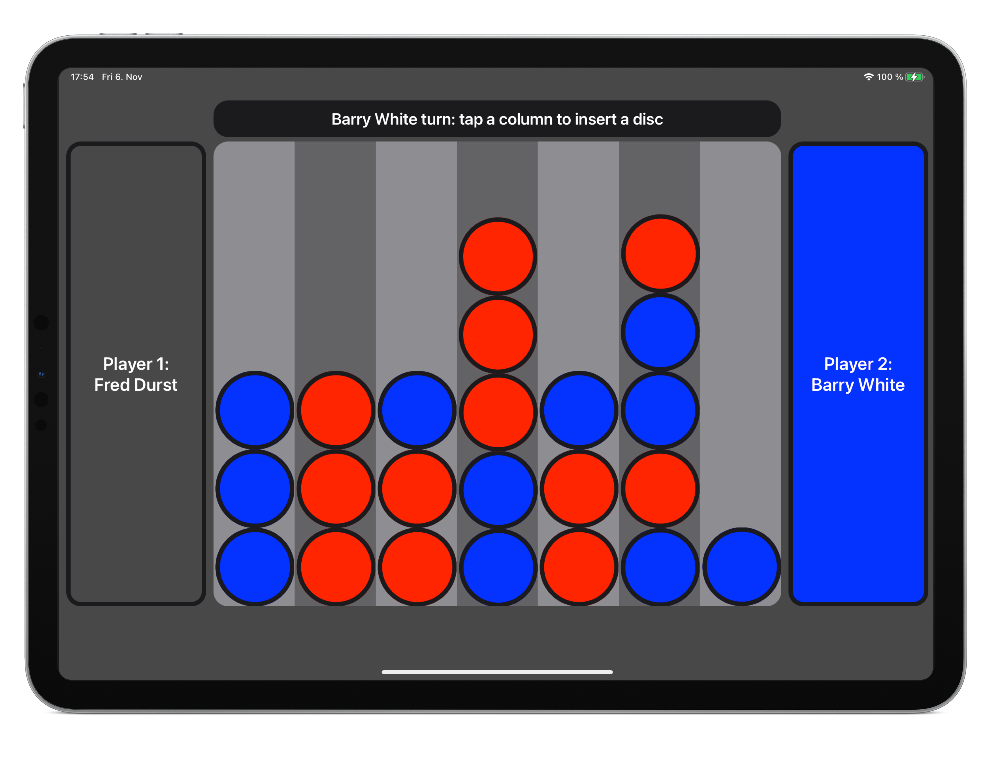

# ConnectFour

 

### Connect Four Game coded in Swift.
Demonstrating: 
* remote config loading
* game logic architecture
* logic unit tests
* UIKitDynamics

(completed as part of a coding challenge)

